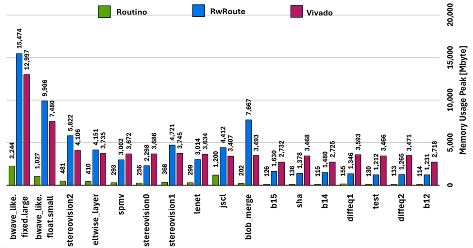

# Routino 

Routino is a lightweight, high-performance FPGA routing tool.  
Compared to state-of-the-art routers, Routino reduces memory usage by an average of 90% while improving routing time by approximately 40%.

These improvements are achieved by exploiting redundancy in the FPGA fabric and building a compressed representation of the Routing Resource Graph (RRG), referred to as the Compressed Routing Resource Graph (CRRG).

This work was presented at FPL 2025

## Quick start

```bash
git clone https://github.com/Quadrollopo/Routino-fpga-router.git
python3 -m venv .venv
make xcvu3p.device

cmake -DCMAKE_BUILD_TYPE=Release -G Ninja -S ./routino -B ./routino/cmake-build-release
cmake --build ./routino/cmake-build-release --target fpga_router -j 

make BENCHMARKS="logicnets_jscl"
```

# Getting started
## Requirements

Routino takes as input a placed but unrouted design in the FPGA Interchange Format (FPGAIF) and produces a routed design in the same format.

* Only signal nets are routed
* Other nets (including already routed nets) are ignored

### Python environment
To run the Python scripts (which are required if you launch the workflow with make), create a virtual environment: 
```
python3 -m venv .venv
```
### Device files
Routino requires a device description file to generate its internal data structures.

To generate the device file for the Xilinx UltraScale+ xcvu3p device, run:
```
make xcvu3p.device
```
This command will automatically download `xcvu3p.device`  
Routino is currently tested on this device.  
While it *should* work also on other devices, it is not garanteeded, especially for architectures that differ significantly from UltraScale+.

## Build (CMake)

Routino is built with CMake.

```bash
# from the repo root
cmake -DCMAKE_BUILD_TYPE=Release -G Ninja -S ./routino -B ./routino/cmake-build-release
cmake --build ./routino/cmake-build-release --target fpga_router -j 
```

## Routing flow


Routino relies on its Compressed Routing Resource Graph (CRRG) to work.
* On the first run, Routino checks whether the CRRG already exists
* If not, it is generated automatically
* CRRG generation may take several minutes, but it is performed only once
* Subsequent runs reuse the CRRG and are significantly faster

## Routing your first design

You can launch the router in two way:
- using make
- running the binary directly

### Running the binary
Running the binary can be done with
```
path/to/routino/binary <placed_design_unrouted.phys> <routed_design.phys>
```
* The first argument is the placed FPGAIF design
* The second argument is the output routed design


### Running an example with `make`
```
make BENCHMARKS="logicnets_jscl"
```

This command:
* Routes the design
* Checks routing correctness
* Generates a Vivado checkpoint for further analysis

## Memory peak comparison
The following figure compares peak memory usage across a set of designs, comparing Routino with RwRoute and Vivado.  
Routino shows a substantial reduction in memory usage.




## Known issues

- Particularly dense designs may fail to converge
- On some UltraScale+ families, certain nets are not routed
  These nets appear to be point-to-point and should be trivial to handle, but are currently not supported

## FAQ

**Why is memory usage so low?**  
Routino exploits structural redundancy in FPGA routing resources and uses a compressed RRG representation.

**Does this replace Vivado routing?**  
No. Routino is a research tool and currently focuses on FPGAIF-based flows.

